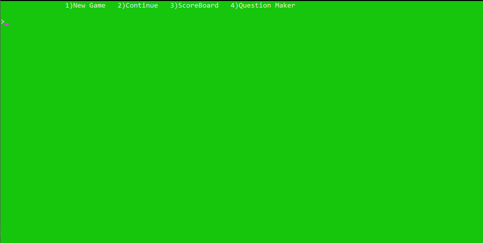
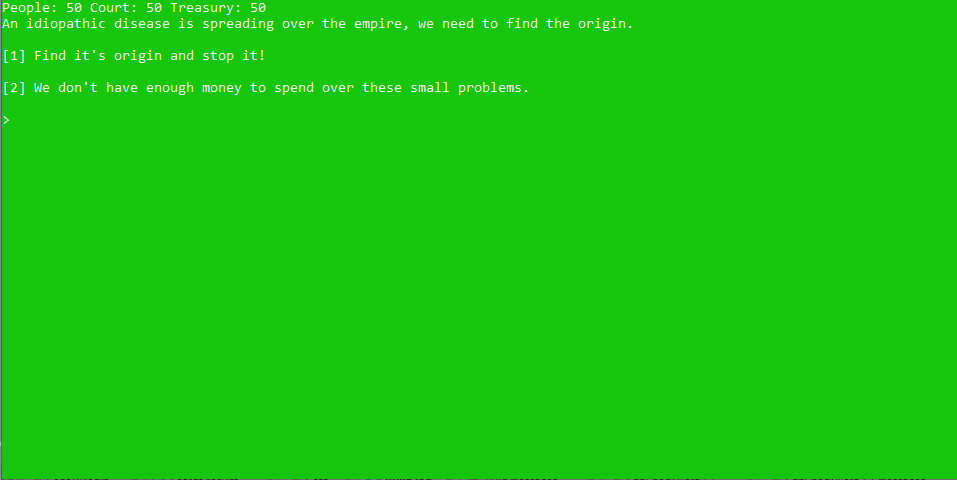
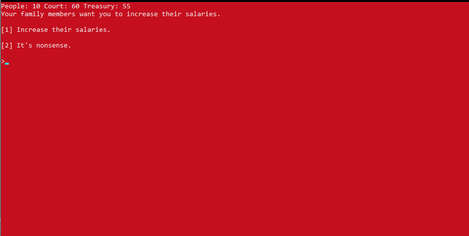

# Emperor
A strategic game that implements with C language.

and also the first university project.

## How it works
- This a strategic game
- In this game user must make decisions to rule a land
- And here we have three parameters to be contoroled by user decisions
- Working with file
- Saving game states when user wants
- Able to load new game or continue the last game

### Screen Shots

